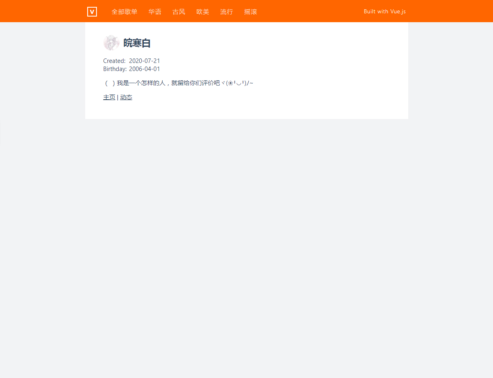

# vue-ssr-music163

本项目为`vue-ssr`学习实践项目，使用 [vue-hackernews-2.0](https://github.com/vuejs/vue-hackernews-2.0/) 项目修改而成，
并使用 [网易云音乐API](https://binaryify.github.io/NeteaseCloudMusicApi/#/) 提供数据接口获取数据


## Architecture Overview


**A detailed Vue SSR guide can be found [here](https://ssr.vuejs.org).**

**A detailed vue-hackernews-2.0 guide can be found [here](https://github.com/vuejs/vue-hackernews-2.0/).**

## Build Setup

**Requires Node.js 7+**

``` bash
# install dependencies
npm install # or yarn

# serve in dev mode, with hot reload at localhost:8080
npm run dev

# build for production
npm run build

# serve in production mode
npm start
```

## License

MIT

[网易云音乐API](https://binaryify.github.io/NeteaseCloudMusicApi/#/)


## 项目截图

列表页


详情页


用户详情页


